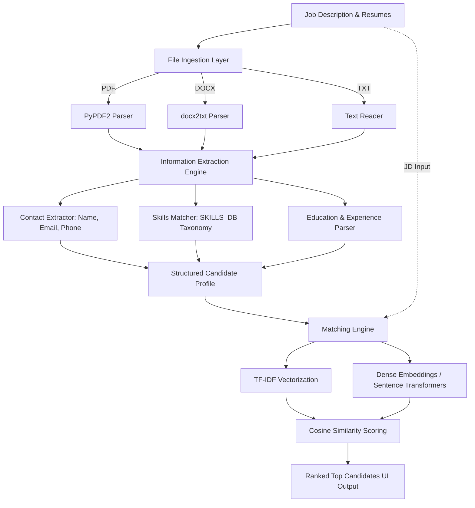

# 📄 AI-Powered Job Description & Resume Matcher

[](https://www.python.org/)
[](https://palletsprojects.com/p/flask/)
[](https://scikit-learn.org/)
[](LICENSE)

An intelligent resume screening and applicant tracking system (ATS) that automatically parses resumes, extracts key candidate information, and ranks applicants against a given job description using NLP similarity scoring.

---

## 🌟 Key Features

- **Multi-Format Document Parsing**: Seamlessly extract text from `.pdf`, `.docx`, and `.txt` resume files.
- **Automated Information Extraction**:
  - **Personal Details**: Candidate Name, Email address, and Phone number.
  - **Skills Detection**: Broad taxonomy matching across programming languages, web frameworks, AI/ML, cloud, DevOps, databases, and soft skills.
  - **Education & Experience**: Structured parsing of academic degrees, institutions, and professional work history.
- **Relevance Scoring & Ranking**:
  - **TF-IDF & Cosine Similarity**: Fast, lightweight vector similarity scoring to quantify candidate-job alignment.
  - **Semantic Embeddings Support**: Extensible architecture supporting dense semantic embeddings via `SentenceTransformer` (`all-MiniLM-L6-v2`).
- **Interactive Web Interface**: Clean, modern, and responsive UI built with Bootstrap and CSS for batch resume uploading and live score visualization.
- **Standalone Exploration Notebook**: Interactive Jupyter Notebook (`text_extractor.ipynb`) for regex extraction testing and prototyping with zero external dependency overhead.

---

## 🏗️ System Architecture & Workflow



---

## 📁 Project Structure

```text
JD_Matcher/
├── templates/
│   └── matchresume.html      # Responsive web UI for resume upload and result display
├── uploads/                  # Temporary storage directory for uploaded candidate files
├── text_extractor.ipynb      # Prototyping notebook for text & entity extraction
├── main.py                   # Main Flask application with extraction and matching routes
├── requirements.txt          # Python dependencies
├── .env.example              # Sample environment variable template
├── .gitignore                # Git ignore rules
└── README.md                 # Project documentation
```

---

## 🚀 Getting Started

### Prerequisites

- **Python 3.8+** installed on your system.
- Git installed on your system.

### 1. Clone the Repository

```bash
git clone https://github.com/VANSHPAR/JD_and_Resume_Matcher.git
cd JD_and_Resume_Matcher
```

### 2. Create and Activate a Virtual Environment

**Windows (PowerShell):**
```powershell
python -m venv .venv
.\.venv\Scripts\Activate.ps1
```

**macOS / Linux:**
```bash
python3 -m venv .venv
source .venv/bin/activate
```

### 3. Install Dependencies

```bash
pip install -r requirements.txt
```


### 4. Configure Environment Variables (Optional)

Copy the sample environment file to `.env`:

```bash
cp .env.example .env
```

If utilizing Hugging Face or LLM embeddings, add your respective tokens:
```env
HF_TOKEN=your_huggingface_token_here
```

---

## 💻 Running the Application

Start the Flask development server:

```bash
python main.py
```

Once started, open your browser and navigate to:
```
http://127.0.0.1:5000/
```

### How to Use:
1. Paste the target **Job Description** into the designated text area.
2. Select and upload candidate resumes (**PDF**, **DOCX**, or **TXT** format).
3. Click **Match Resumes**.
4. Review the dynamically generated list of top-ranked candidates with their similarity scores.

---

## 🧪 Interactive Notebook

To experiment with the extraction pipeline and skill database interactively:

```bash
jupyter notebook text_extractor.ipynb
```

The notebook contains standalone extraction functions for:
- Contact information (Email, Phone, Name heuristics)
- Categorized skill matching against `SKILLS_DB`
- Section segmentations (Education, Work Experience)

---

## 🛠️ Tech Stack

| Component | Technology | Description |
|---|---|---|
| **Backend** | Python, Flask | Web server and routing |
| **Frontend** | HTML5, CSS3, Bootstrap 4 | Clean user interface with responsive design |
| **PDF Extraction** | PyPDF2 | Extracts textual content from PDF files |
| **DOCX Extraction**| docx2txt | Parses Microsoft Word (.docx) resumes |
| **Information Extraction** | Regular Expressions (`re`) | Rule-based entity & section extraction |
| **Similarity & NLP** | scikit-learn (`TfidfVectorizer`, `cosine_similarity`) | TF-IDF vectorization and cosine metric |
| **Semantic Embeddings** | SentenceTransformers (`all-MiniLM-L6-v2`) | Optional dense contextual embeddings |

---

## 📌 Roadmap & Future Enhancements

- [ ] **Weighting Scheme**: Customizable weighting for skills vs. experience vs. education.
- [ ] **Skill Gap Analysis**: Provide visual feedback on missing keywords/skills for each candidate.
- [ ] **OCR Support**: Ingest scanned and image-based PDFs using Tesseract OCR.
- [ ] **LLM Summarization**: Automated candidate profile summaries using OpenAI or Groq APIs.
- [ ] **Export Results**: Export ranked candidates to CSV or PDF reports.

---

## 📄 License

This project is licensed under the [MIT License](LICENSE).
